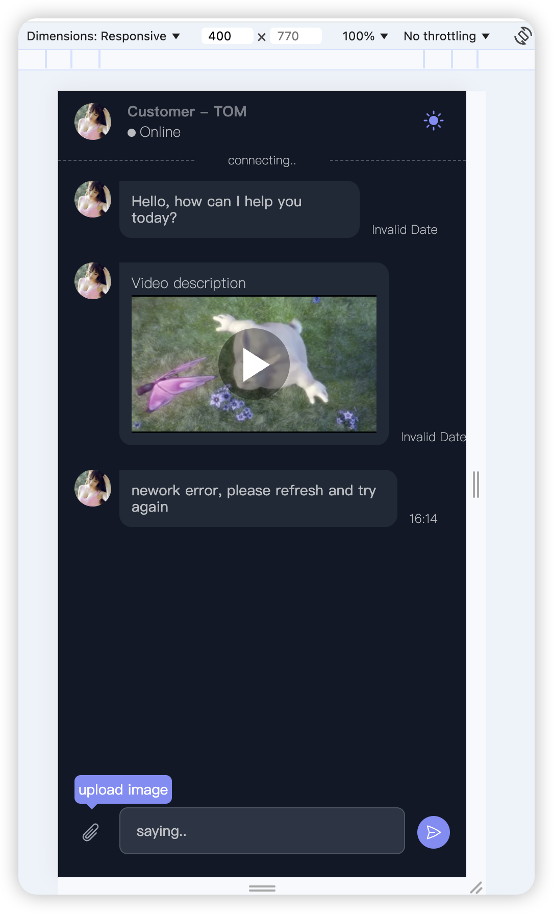
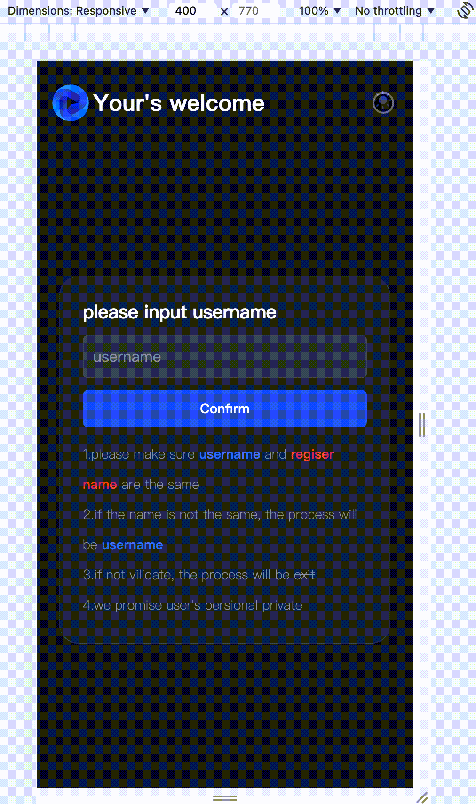

# screenshots

<div align="center">
  <div style="display: flex;">
    
    
  </div>
</div>

# start

```shell
cd [this project]

pnpm i

pnpm dev

```

# config

1. `.env` file is for host

2. `src/net.config.ts` file is for server config

> below is already use into this project,do not use again

# create vite project

`yarn create vite`

choose vue、ts

`cd my-project`

# init tailwind

`yarn add -D tailwindcss postcss autoprefixer`

`npx tailwindcss init -p`

# replace code in tailwind.config

rename js to ts if possible

```ts
/** @type {import('tailwindcss').Config} */
export default {
  content: ['./index.html', './src/**/*.{vue,js,ts,jsx,tsx}'],
  theme: {
    extend: {},
  },
  plugins: [],
}
```

# add css

```css
@tailwind base;
@tailwind components;
@tailwind utilities;
```

# eslint

`yarn add -D eslint`

`npx eslint --init`

for more:https://segmentfault.com/a/1190000041954694
